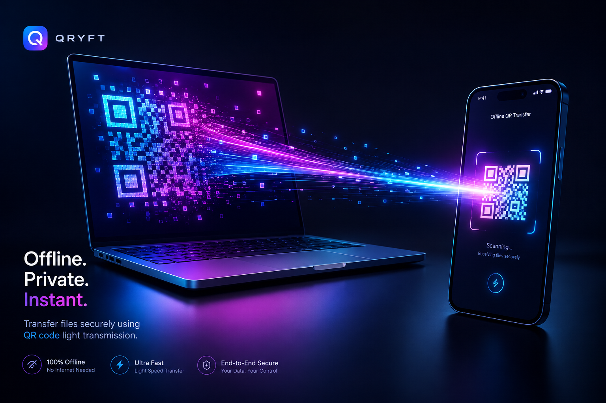

# 📡 AirBeam QR — Optical Air-Gapped File Transfer Engine

<p align="center">
  
</p>

<p align="center">
  
  
  
  
  
</p>

<p align="center">
  <b>AirBeam QR</b> is a high-speed, zero-trust, client-side web application for <b>Optical Air-Gapped Data Transmission via Animated QR Codes</b>. Share files instantly between PC, Mac, iPhone, and Android without Wi-Fi, Bluetooth, Mobile Data, or Cables.
</p>

---

## 🎯 Keywords & Search Topics

`qr file transfer` • `optical data transfer` • `animated qr code file transfer` • `air gapped file transfer` • `offline file sharing` • `camera qr code stream` • `airdrop alternative` • `peer to peer visual transfer` • `browser file sharing` • `zero radio file transfer` • `qr stream file share` • `screen to camera data beam`

---

## 📋 Table of Contents
- [⚙️ Recommended Settings (Optimal Speed)](#️-recommended-settings-optimal-speed)
- [✨ Key Features](#-key-features)
- [📊 Technology Comparison](#-technology-comparison)
- [🛠️ Architecture & Transmission Protocol](#️-architecture--transmission-protocol)
- [🚀 Quick Start Guide](#-quick-start-guide)
- [💡 Use Cases](#-use-cases)
- [⚡ Performance & Throughput Benchmarks](#-performance--throughput-benchmarks)
- [📦 Project Structure](#-project-structure)
- [🤝 Contributing & License](#-contributing--license)

---

## ⚙️ Recommended Settings (Optimal Speed)

For maximum transfer speed and 100% instant camera scanning accuracy, use the following **Sweet Spot Settings**:

| Parameter | Recommended Setting | Purpose & Impact |
| :--- | :--- | :--- |
| **⚡ Beam Speed (FPS)** | **20 FPS – 25 FPS** | Aligns PC display refresh rate with mobile camera shutter speed (0% dropped frames). |
| **📐 QR Chunk Density** | **350 Bytes – 450 Bytes** | Produces bold, crisp modules that mobile cameras decode in 1 frame flat (50ms). |
| **🎨 QR Visual Style** | **🎨 Fluid Circuit** | Features rounded liquid circuit modules with mandatory ISO 4-module quiet zone margin. |
| **💡 Screen Brightness** | **80% – 100%** | Delivers maximum optical black/white contrast for instantaneous lens focus. |
| **📱 Camera Positioning** | **15 cm – 25 cm** | Hold mobile camera steady so the QR frame occupies 60%-70% of the viewfinder screen. |

---

## ✨ Key Features

- 🛡️ **100% Air-Gapped Security:** Transmits data using **light photons (screen ➔ camera)**. Zero radio emissions, completely immune to Wi-Fi sniffing, Bluetooth eavesdropping, or local network attacks.
- 🎨 **Fluid Circuit Art QR Engine:** Features custom-rendered rounded liquid QR modules with a central target logo badge matching modern design aesthetics.
- ⚡ **0% CPU Lag Pre-Rendered Engine:** Pre-computes QR matrix frames in memory for smooth 30-60 FPS streaming with **< 1% CPU usage**.
- 📱 **Hardware-Accelerated Camera Scanner:** Integrated mobile `BarcodeDetector` API for GPU-accelerated scanning at **30 to 60 FPS**.
- 📦 **Native Gzip Compression:** Leverages Web `CompressionStream('gzip')` to compress text, documents, code, and images by up to 80%.
- 🧩 **Interactive Chunk Reassembly Matrix:** Real-time glowing grid visualizer showing received vs missing chunks.
- 🧪 **Single-Screen Loopback Simulator:** Built-in side-by-side simulator to test visual optical transfer right on 1 device.

---

## 📊 Technology Comparison

| Feature / Tech | 📡 AirBeam QR (Optical) | 📶 Wi-Fi Direct / Local IP | 🔵 Bluetooth | 🍏 Apple AirDrop |
| :--- | :--- | :--- | :--- | :--- |
| **Network Needed?** | ❌ **NONE (0% Network)** | ⚠️ Same Wi-Fi Router | ⚠️ Bluetooth Radio | ⚠️ Wi-Fi + Bluetooth |
| **Cross-Platform?** | ✅ **PC, Mac, iOS, Android** | ⚠️ Complex Config | ⚠️ OS Restrictions | ❌ Apple Only |
| **Air-Gapped Secure?** | ✅ **100% Photonic Air-Gap** | ❌ Vulnerable to Sniffing | ❌ Vulnerable to Exploits | ❌ Network Dependent |
| **Installation Needed?** | ❌ **Pure Web App (No App)** | ⚠️ Native App Needed | ⚠️ Native Pair Needed | ❌ Built-in Only |

---

## 🛠️ Architecture & Transmission Protocol

```text
+------------------+       Gzip + Base64      +-------------------------+
|   Sender File    |  =====================>  | Animated QR Generator   |
| (Image/PDF/Code) |                          | (20-30 FPS Light Stream)|
+------------------+                          +-------------------------+
                                                           ||
                                              PHOTONS / LIGHT EMISSION
                                                           ||
                                                           \/
+------------------+     Decompress & Blob    +-------------------------+
| Reassembled File |  <=====================  | Mobile Camera Scanner   |
|   (Downloaded)   |                          | (Hardware GPU Decoder)  |
+------------------+                          +-------------------------+
```

### Protocol Format
```text
AQRT:1:<TransferID>:<ChunkIndex>:<TotalChunks>:<PayloadData>
```
- **Chunk 0 (Meta Payload):** Encodes filename, file size, mime-type, total chunk count, and gzip flag.
- **Chunks 1 to N (Data Payloads):** Encodes Base64 binary slices of the file.

---

## 🚀 Quick Start Guide

### 1. Clone & Run Locally

```bash
git clone https://github.com/your-username/airbeam-qr.git
cd airbeam-qr
```

#### Running HTTPS Local Server (Recommended for Mobile Camera)
```bash
python3 -c "import http.server, ssl; httpd = http.server.HTTPServer(('0.0.0.0', 8443), http.server.SimpleHTTPRequestHandler); ctx = ssl.SSLContext(ssl.PROTOCOL_TLS_SERVER); ctx.load_cert_chain(certfile='cert.pem', keyfile='key.pem'); httpd.socket = ctx.wrap_socket(httpd.socket, server_side=True); print('Server running on https://localhost:8443'); httpd.serve_forever()"
```

Open `https://localhost:8443` on your PC and `https://<YOUR_LOCAL_IP>:8443` on your mobile device!

---

### 2. Free 1-Click Cloud Deployment (Netlify / Vercel)

Since **AirBeam QR** is 100% client-side HTML5/CSS/JS with zero backend server dependencies:
1. Open **[Netlify Drop](https://app.netlify.com/drop)**.
2. Drag and drop the repository folder.
3. Get a live permanent HTTPS link (e.g., `https://airbeam-qr.netlify.app`) in 5 seconds!

---

## 💡 Use Cases

1. **Air-Gapped & Secure Environments:** Transfer code, keys, and documents into high-security isolated workstations without network cards or USB access.
2. **Offline Cross-Platform File Sharing:** Instantly transfer photos, text snippets, or code from Mac/PC to iPhone/Android when traveling without cellular data or Wi-Fi.
3. **Zero-Trust Environments:** Prevent data leakage, network logging, or packet inspection by routing data through light photons.

---

## ⚡ Performance & Throughput Benchmarks

| File Size | Chunks (at 350B) | Beam Speed | Transfer Time |
| :--- | :--- | :--- | :--- |
| **50 KB** (Docs / Code) | ~40 Chunks | 20 FPS | **~2.5 Seconds** |
| **200 KB** (PDF / Text) | ~140 Chunks | 25 FPS | **~6 Seconds** |
| **500 KB** (Image / Photo) | ~350 Chunks | 25 FPS | **~14 Seconds** |

---

## 📦 Project Structure

```text
QR transfer/
├── img1.png              # Main Hero Banner Image for GitHub Repository
├── index.html            # Responsive HTML5 layout with Glassmorphic tabs & cards
├── styles.css            # Dark futuristic design system with CSS tokens
├── app.js                # Core engine (Chunker, Gzip, QR Renderer, Scanner, Simulator)
├── vendor/
│   ├── qrcode_gen.js     # High-performance QR matrix generator (Auto Version 1-40)
│   └── jsqr.min.js       # Fallback JS camera scanner engine
├── cert.pem / key.pem    # Self-signed SSL certificates for mobile HTTPS camera testing
└── README.md             # SEO-optimized GitHub documentation with Hero Banner
```

---

## 🤝 Contributing & License

Contributions, issues, and feature requests are welcome!

Distributed under the **MIT License**. Free for commercial and personal open-source projects.
